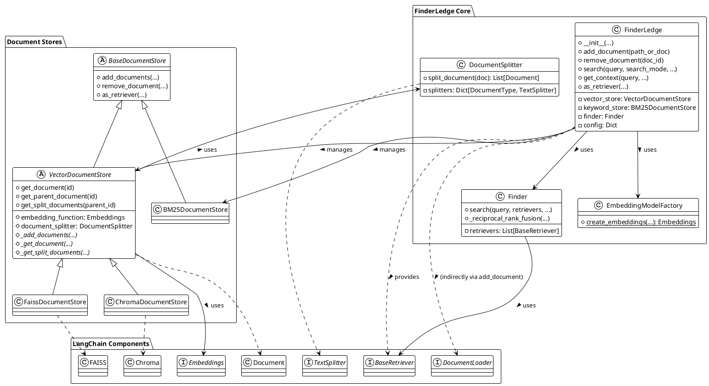
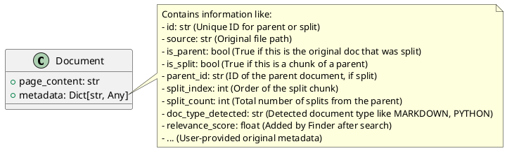

# FinderLedge アーキテクチャ設計書

## 1. システム構成・アーキテクチャの概要

FinderLedge は、RAG アプリケーションにおけるアンサンブル検索の複雑さを隠蔽し、シンプルなインターフェースを提供することに主眼を置いています。内部的には LangChain のコンポーネントを組み合わせ、設定に基づいて適切なドキュメントストア（ベクトルストア、キーワードストア）と検索ロジックを管理します。

主要なコンポーネントは以下の通りです：

1.  **`FinderLedge` クラス:** ユーザーが直接操作するメインインターフェース。設定の管理、ドキュメントストアの初期化、文書の追加・削除、検索の実行、LangChain Retriever としての機能提供を担当します。
2.  **ドキュメントストア (`DocumentStore`):**
    *   `VectorDocumentStore` (抽象基底クラス): ベクトル検索のための共通ロジック（文書分割など）を提供。
        *   `ChromaDocumentStore`: ChromaDB をバックエンドとする実装。
        *   `FaissDocumentStore`: FAISS をバックエンドとする実装。
    *   `BM25DocumentStore`: BM25 アルゴリズムに基づくキーワード検索ストアの実装。
3.  **埋め込みモデルファクトリ (`EmbeddingModelFactory`):** 設定に基づいて適切な LangChain 埋め込みモデル (OpenAI, Ollama, SentenceTransformer など) を生成します。
4.  **ドキュメント分割 (`DocumentSplitter`):** 文書の内容やメタデータに基づいて適切な LangChain TextSplitter を選択し、文書をチャンクに分割します。
5.  **ファインダー (`Finder`):** 複数の Retriever (ベクトルストア、キーワードストアから生成) を受け取り、指定された検索モード (hybrid, vector, keyword) で検索を実行し、結果を統合 (RRF) します。
6.  **LangChain コンポーネント:** Document Loaders, Text Splitters, Embedding Models, Vectorstores (Chroma, FAISS) など、内部で LangChain の様々なクラスを利用しています。

## 2. 主要インターフェース

FinderLedge における主要なインターフェースは `FinderLedge` クラスです。

| クラス名 | 説明 | 責務 |
|---|---|---|
| **`FinderLedge`** | **メインインターフェース** | - 設定（環境変数、引数）の読み込みと管理 - 指定された設定に基づく `VectorDocumentStore`, `BM25DocumentStore`, `EmbeddingModelFactory`, `Finder` の初期化と保持 - `add_document`: ファイル/ディレクトリの読み込み、パース、チャンキング、ストアへの追加 - `remove_document`: 指定ドキュメント（親子共）のストアからの削除 - `search`: `Finder` を使用した検索実行（ハイブリッド/ベクトル/キーワード）、RRFによる結果統合 - `get_context`: 検索結果の整形とコンテキスト文字列生成 - `as_retriever`: LangChain の `BaseRetriever` 互換インターフェースの提供 |
| `VectorDocumentStore` (Chroma/FAISS) | ベクトルストア管理 | - 文書（親子）のベクトルストアへの追加・削除 - ベクトル検索の実行 - 文書（親子、分割）の取得 - Retriever の提供 - インデックスの永続化/ロード |
| `BM25DocumentStore` | キーワードストア管理 | - 文書のキーワードストアへの追加・削除 - BM25 検索の実行 - Retriever の提供 - インデックスの永続化/ロード |
| `Finder` | 検索実行・統合 | - 複数の Retriever を用いた検索の実行 - 検索モードに応じた処理分岐 - Reciprocal Rank Fusion (RRF) によるスコア計算とランキング |
| `EmbeddingModelFactory` | 埋め込みモデル生成 | - 設定に応じた LangChain 埋め込みモデルインスタンスの生成 |
| `DocumentSplitter` | 文書分割 | - 文書タイプに基づいた適切な LangChain TextSplitter の選択と実行 |

## 3. 主要データ（データの種類、構造）

FinderLedge が主に扱うデータは LangChain の `Document` オブジェクトです。

### 3.1 データフロー

**文書追加 (`add_document`) フロー:**

1.  入力パスがファイルかディレクトリか判定。
2.  LangChain の `DocumentLoader` を使用してファイルを読み込み、`Document` オブジェクトリストを生成。
3.  `FinderLedge` が保持する `VectorDocumentStore` および `BM25DocumentStore` の `add_documents` を呼び出す。
4.  `VectorDocumentStore.add_documents` 内部:
    *   各ドキュメントに対して `DocumentSplitter.split_document` を実行。
    *   分割が発生した場合、元のドキュメントに `is_parent=True`, `split_count` メタデータを設定。
    *   親ドキュメント、分割チャンク（`is_split=True`, `parent_id` 等は Splitter が設定）、または分割されなかった元のドキュメントをリストに収集。
    *   収集した全ドキュメントを `_add_documents` (Chroma/FAISS の実装) に渡して永続化。
5.  `BM25DocumentStore.add_documents` 内部:
    *   ドキュメントのテキストをインデックスに追加。
    *   インデックスを永続化。

**検索 (`search`) フロー:**

1.  `FinderLedge` が `Finder.search` を呼び出す。
2.  `Finder` は、保持している `VectorDocumentStore` と `BM25DocumentStore` から `BaseRetriever` を取得。
3.  指定された `search_mode` に応じて:
    *   `hybrid`: 両方の Retriever で検索を実行し、結果を RRF で統合。
    *   `vector`: Vector Retriever のみで検索。
    *   `keyword`: Keyword Retriever のみで検索。
4.  取得した `Document` オブジェクト（メタデータにスコアが付与される）をリストとして返す。

### 3.2 永続化データ構造

永続化は、初期化時に指定された `persist_directory` 以下に、各ドキュメントストアが自身のデータを保存します。

*   **Chroma:**
    *   `persist_directory/chroma/` (デフォルト) 以下に SQLite ファイル (`chroma.sqlite3`) と Parquet ファイル (データチャンク) が作成されます。
    *   コレクション名（デフォルト: `finderledge_vector_store`）ごとにデータが管理されます。
*   **FAISS:**
    *   `persist_directory/faiss/` (デフォルト) 以下に `index.faiss` (ベクトルインデックス) と `index.pkl` (ドキュメント ID とメタデータのマッピング) が作成されます。
*   **BM25:**
    *   `persist_directory/bm25/` (デフォルト) 以下に BM25 インデックスデータ (通常は pickle 化されたオブジェクト) が保存されます (`bm25_index.pkl` など)。 