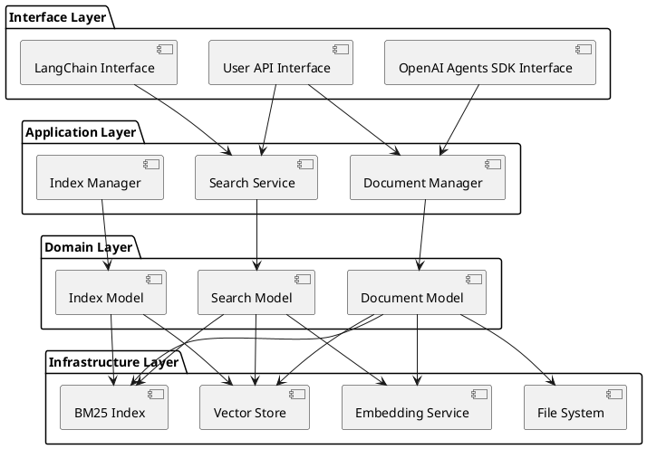
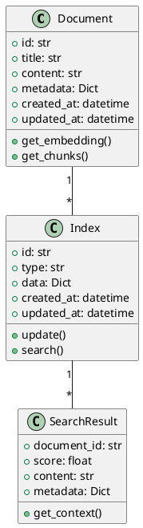

# FinderLedge アーキテクチャ設計書

## 1. システム構成・アーキテクチャの概要

### 1.1 レイヤーアーキテクチャ
FinderLedgeは、クリーンアーキテクチャの原則に従い、以下のレイヤーで構成されます：

1. インターフェース層（Interface Layer）
   - 外部システムとの連携インターフェース
   - OpenAI Agents SDK、LangChain等との統合
   - ユーザー向けAPIの提供

2. アプリケーション層（Application Layer）
   - ユースケースの実装
   - 文書管理、検索、インデックス更新などの主要機能
   - ドメインロジックの調整

3. ドメイン層（Domain Layer）
   - コアビジネスロジック
   - 文書、インデックス、検索結果などのドメインモデル
   - ドメインルールの実装

4. インフラストラクチャ層（Infrastructure Layer）
   - 外部サービスとの連携
   - データの永続化
   - ファイルシステム操作

### 1.2 コンポーネント構成

## 2. 主要インターフェース

### 2.1 インターフェース層の主要クラス
| クラス名 | 説明 | 責務 |
|----------|------|------|
| `OpenAIAgentsInterface` | OpenAI Agents SDKとの連携 | - エージェントツールの提供 - コンテキストの統合 |
| `LangChainInterface` | LangChainとの連携 | - Retrieverの実装 - 検索結果の変換 |
| `UserAPIInterface` | ユーザー向けAPI | - 文書管理API - 検索API |

### 2.2 アプリケーション層の主要クラス
| クラス名 | 説明 | 責務 |
|----------|------|------|
| `DocumentManager` | 文書管理 | - 文書の追加・削除 - インデックス更新の制御 |
| `SearchService` | 検索サービス | - ハイブリッド検索の実行 - 検索結果の統合 |
| `IndexManager` | インデックス管理 | - インデックスの永続化 - 差分更新の制御 |

### 2.3 ドメイン層の主要クラス
| クラス名 | 説明 | 責務 |
|----------|------|------|
| `Document` | 文書モデル | - 文書メタデータ管理 - 文書内容の管理 |
| `Index` | インデックスモデル | - インデックス構造の管理 - 更新履歴の管理 |
| `SearchResult` | 検索結果モデル | - 検索結果の構造化 - スコアリング |

### 2.4 インフラストラクチャ層の主要クラス
| クラス名 | 説明 | 責務 |
|----------|------|------|
| `VectorStore` | ベクトルストア | - ベクトルデータの永続化 - ベクトル検索 |
| `BM25Index` | BM25インデックス | - キーワードインデックスの管理 - BM25検索 |
| `FileSystem` | ファイルシステム | - 文書ファイルの管理 - キャッシュ管理 |
| `EmbeddingService` | 埋め込みサービス | - テキストのベクトル化 - モデル管理 |

## 3. 主要データ（データの種類、構造）

### 3.1 ドメインモデル

### 3.2 データフロー
1. 文書追加フロー
   - 文書ファイルの読み込み
   - テキスト抽出とチャンク分割
   - ベクトル埋め込みの計算
   - インデックスの更新

2. 検索フロー
   - クエリの前処理
   - ベクトル検索とキーワード検索の実行
   - 結果の統合とスコアリング
   - コンテキストの生成

3. インデックス更新フロー
   - 変更の検出
   - 差分の計算
   - インデックスの更新
   - キャッシュの更新

### 3.3 永続化データ構造
1. ベクトルストア（ChromaDB）
   - コレクション：文書ID、ベクトル、メタデータ
   - インデックス：ベクトル検索用

2. BM25インデックス
   - 文書ID、トークン、スコア
   - 逆引きインデックス

3. メタデータストア
   - 文書情報
   - インデックス情報
   - システム設定 