# FinderLedge 機能仕様書

## 1. 文書管理機能

### 1.1 文書インポート（UC-01）
#### ユースケース手順
1. ユーザーが文書ファイルを指定
2. システムがファイル形式を判定
3. システムが文書をパース
4. システムがテキストを抽出
5. システムがチャンクに分割
6. システムがインデックスを更新

#### ユースケースフロー図
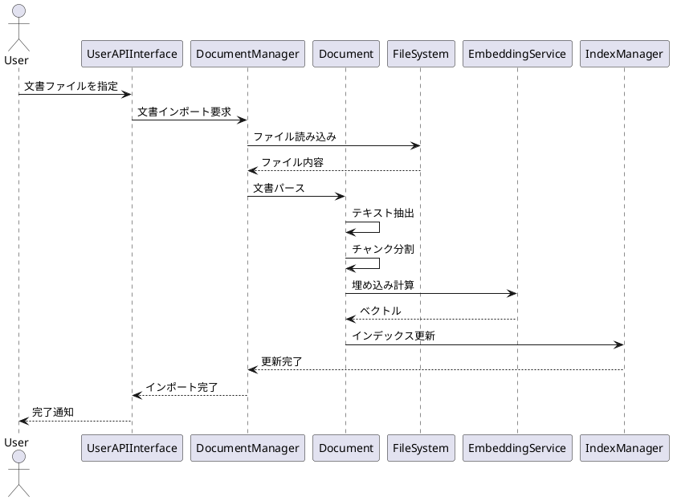

### 1.2 インデックス自動更新（UC-02）
#### ユースケース手順
1. システムが文書変更を検知
2. システムが変更箇所を特定
3. システムが差分を計算
4. システムがインデックスを更新
5. システムがキャッシュを更新

#### ユースケースフロー図
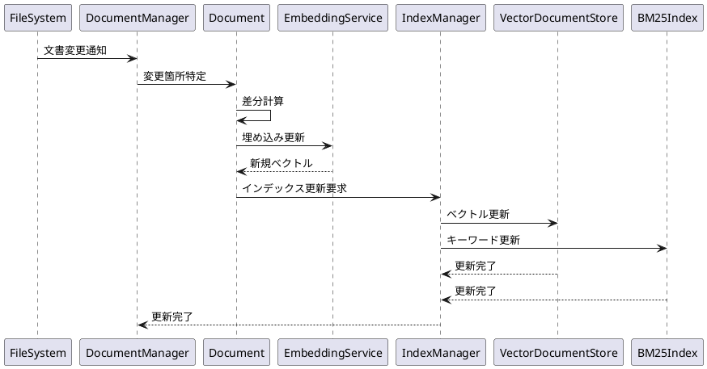

### 1.3 文書削除（UC-03）
#### ユースケース手順
1. ユーザーが文書を指定
2. システムが文書を検証
3. システムがインデックスから削除
4. システムがキャッシュを更新

#### ユースケースフロー図
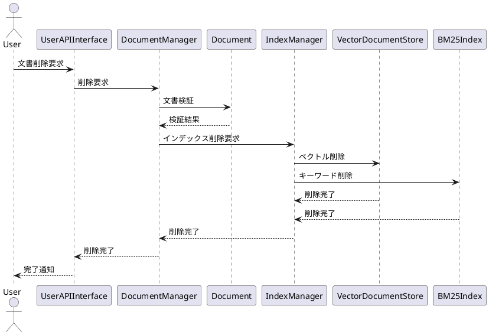

## 2. 検索機能

### 2.1 ハイブリッド検索（UC-04）
#### ユースケース手順
1. ユーザーが検索クエリを入力
2. システムがクエリを前処理
3. システムがベクトル検索を実行
4. システムがキーワード検索を実行
5. システムが結果を統合
6. システムがスコアリングを実行
7. システムが結果を返却

#### ユースケースフロー図
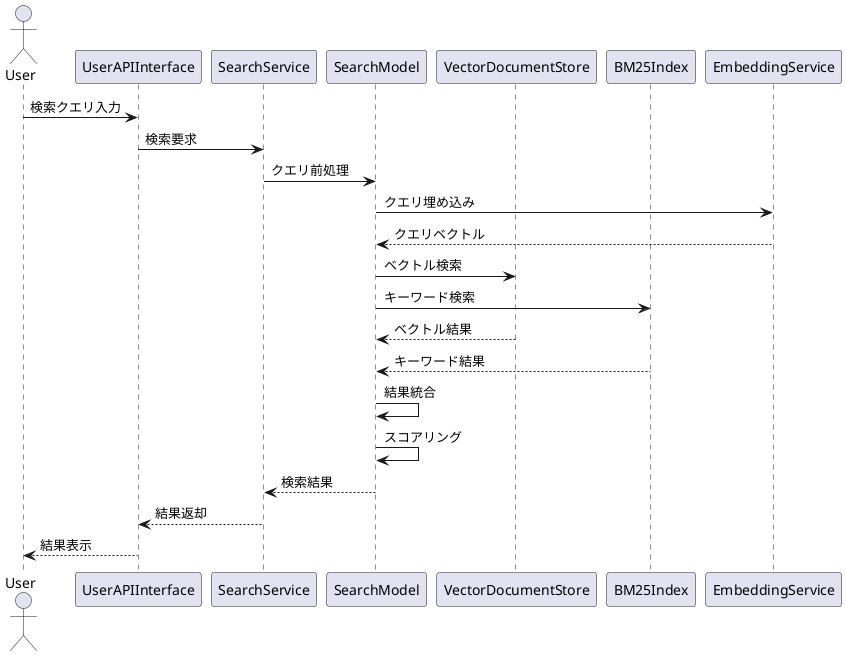

### 2.2 検索モード選択（UC-05）
#### ユースケース手順
1. ユーザーが検索モードを選択
2. システムがモードを設定
3. システムが検索を実行
4. システムが結果を返却

#### ユースケースフロー図
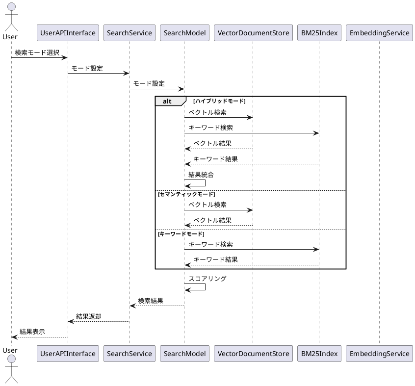

### 2.3 関連コンテキスト取得（UC-06）
#### ユースケース手順
1. LLMエージェントがコンテキスト要求
2. システムが検索を実行
3. システムが結果を構造化
4. システムがコンテキストを生成
5. システムが結果を返却

#### ユースケースフロー図
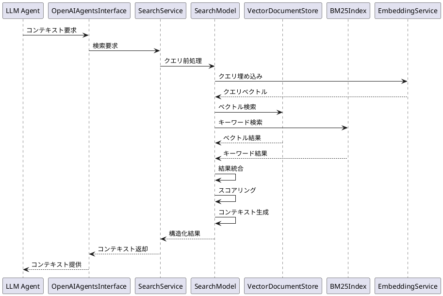

## 3. インデックス管理機能

### 3.1 インデックス永続化（UC-07）
#### ユースケース手順
1. システムがインデックス更新を検知
2. システムがインデックスをシリアライズ
3. システムがファイルに保存
4. システムが完了を通知

#### ユースケースフロー図
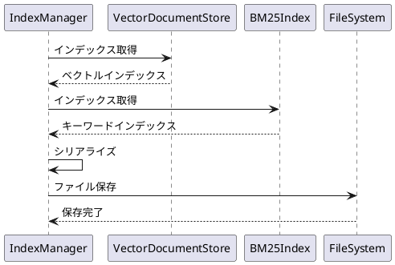

### 3.2 インデックスロード（UC-08）
#### ユースケース手順
1. システムが起動
2. システムがインデックスファイルを検索
3. システムがファイルを読み込み
4. システムがインデックスを復元
5. システムが完了を通知

#### ユースケースフロー図
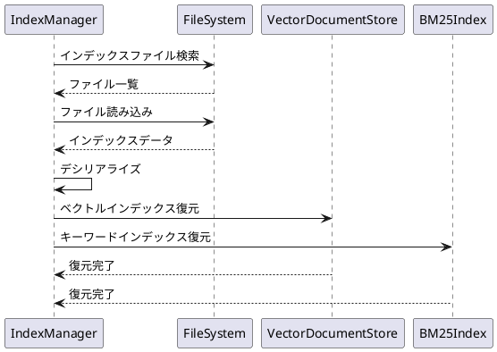

### 3.3 インデックス更新（UC-09）
#### ユースケース手順
1. システムが変更を検知
2. システムが差分を計算
3. システムがインデックスを更新
4. システムがキャッシュを更新
5. システムが完了を通知

#### ユースケースフロー図
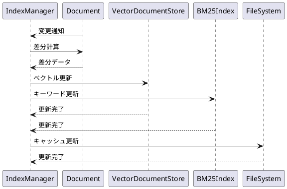

## 4. OpenAI Agents SDK連携機能

### 4.1 ツール統合（UC-10）
#### ユースケース手順
1. エージェントがツールを要求
2. システムがツールを提供
3. エージェントがツールを使用
4. システムが結果を返却

#### ユースケースフロー図
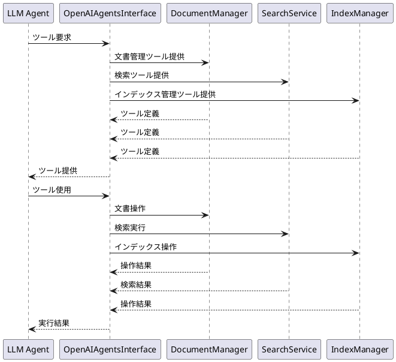

### 4.2 コンテキスト統合（UC-11）
#### ユースケース手順
1. エージェントがコンテキストを要求
2. システムが検索を実行
3. システムがコンテキストを生成
4. システムが結果を返却

#### ユースケースフロー図
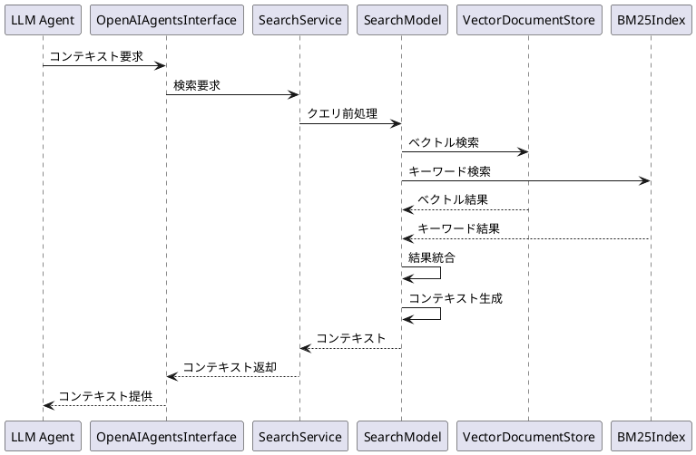

### 4.3 LangChain連携（UC-12）
#### ユースケース手順
1. ユーザーがLangChainを使用
2. システムがRetrieverを提供
3. ユーザーが検索を実行
4. システムが結果を返却

#### ユースケースフロー図
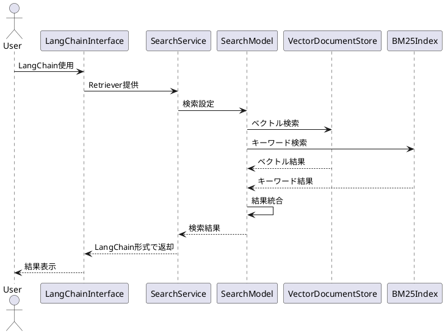