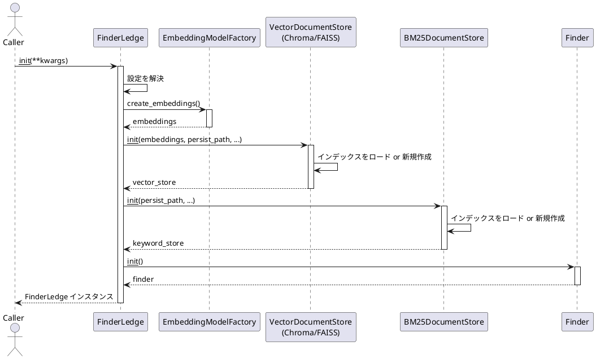
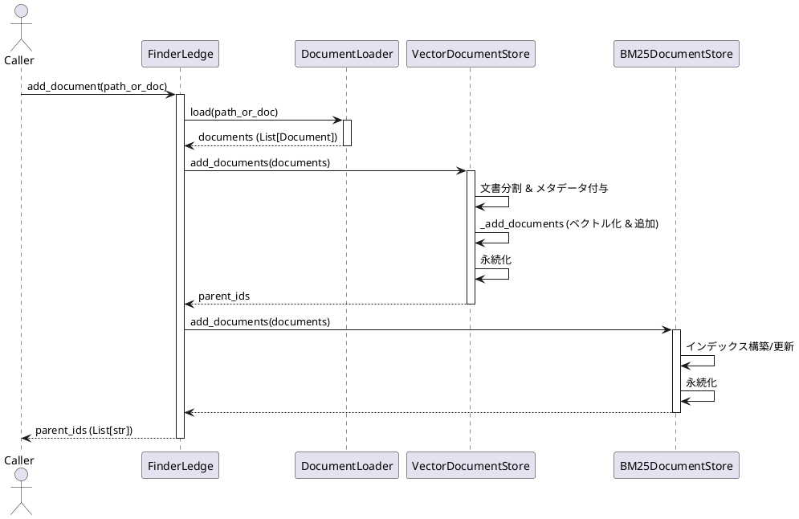
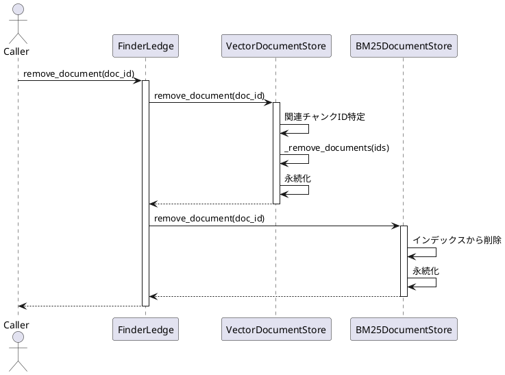
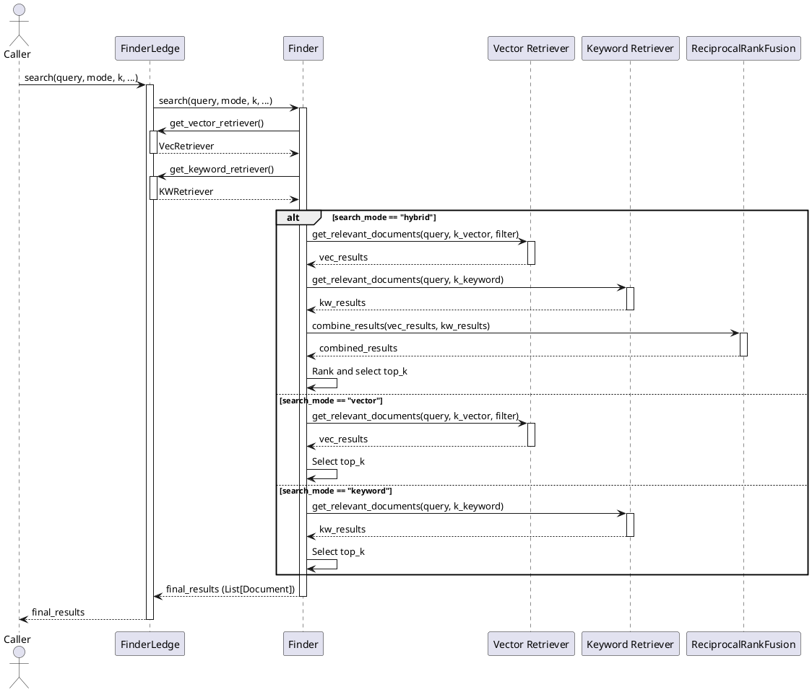
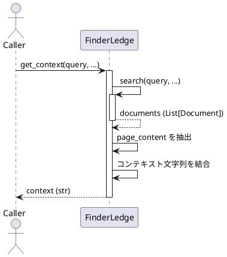
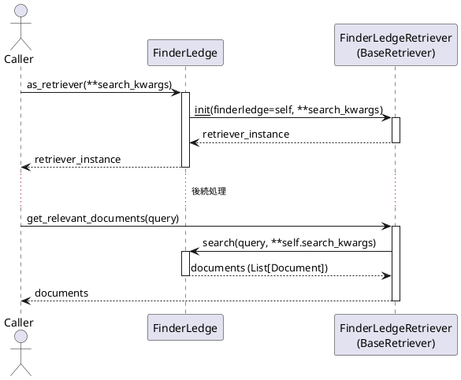

# FinderLedge 機能仕様書

この文書は、`FinderLedge` ライブラリの主要な機能の仕様を定義します。

## 1. `FinderLedge` 初期化 (`__init__`)

### 1.1 機能概要
`FinderLedge` クラスのインスタンスを生成し、設定に基づいて内部コンポーネント（ベクトルストア、キーワードストア、埋め込みモデル、ファインダー等）を初期化します。設定は、環境変数または `__init__` の引数を通じて行われます。

### 1.2 ユースケース手順
1.  呼び出し元が `FinderLedge()` または `FinderLedge(**kwargs)` を実行。
2.  `FinderLedge` は設定（引数、環境変数、デフォルト値）を解決。
3.  `EmbeddingModelFactory.create_embeddings` を呼び出し、設定に基づいた埋め込みモデル (Embeddings) を取得。
4.  設定に基づいて `VectorDocumentStore` (Chroma または FAISS) のインスタンスを生成（埋め込みモデルと永続化パスを渡す）。ストアは内部でインデックスをロードまたは新規作成。
5.  設定に基づいて `BM25DocumentStore` のインスタンスを生成（永続化パスを渡す）。ストアは内部でインデックスをロードまたは新規作成。
6.  `Finder` のインスタンスを生成。
7.  初期化された各コンポーネントをインスタンス変数として保持。

### 1.3 シーケンス図

### 1.4 主要な引数
*   `vector_store_provider` (str): 使用するベクトルストア ("chroma" または "faiss")。
*   `keyword_store_provider` (str): 使用するキーワードストア ("bm25")。
*   `embedding_provider` (str): 使用する埋め込みプロバイダー ("openai", "ollama", "huggingface")。
*   `embedding_model_name` (str): 使用する埋め込みモデル名。
*   `persist_directory` (str): インデックス等の永続化ディレクトリパス。
*   `chunk_size` (int): ドキュメント分割時のチャンクサイズ。
*   `chunk_overlap` (int): ドキュメント分割時のチャンクオーバーラップ。
*   その他、各コンポーネントに渡される `**kwargs`。

## 2. ドキュメント追加 (`add_document`)

### 2.1 機能概要
指定されたファイルパスまたはディレクトリパスからドキュメントを読み込み、パース、分割し、ベクトルストアとキーワードストアの両方に追加（インデックス更新）します。

### 2.2 ユースケース手順
1.  呼び出し元が `ledge.add_document(path)` を実行。
2.  `FinderLedge` は LangChain の `DocumentLoader` を使用して `path` から `Document` オブジェクトのリストを作成。
3.  `FinderLedge` が保持する `VectorDocumentStore` の `add_documents` を呼び出す。
4.  `VectorDocumentStore` は文書をチャンキングし、親と分割チャンクにメタデータを付与して、自身の実装 (`_add_documents`) を呼び出し、ベクトルストア（Chroma/FAISS）にデータを追加・永続化。
5.  `FinderLedge` が保持する `BM25DocumentStore` の `add_documents` を呼び出す。
6.  `BM25DocumentStore` は文書のテキストからインデックスを構築・更新し、永続化。
7.  追加された（親）ドキュメントの ID リストを返す。

### 2.3 シーケンス図

### 2.4 主要な引数
*   `path_or_doc` (str | Path | Document | List[Document]): 追加するドキュメントのファイルパス、ディレクトリパス、または Document オブジェクト（単一またはリスト）。

### 2.5 戻り値
*   `List[str]`: 追加された元のドキュメントに対応する（親）ID のリスト。

## 3. ドキュメント削除 (`remove_document`)

### 3.1 機能概要
指定された（親）ドキュメント ID に関連するすべてのデータ（親ドキュメント、分割チャンク）を、ベクトルストアとキーワードストアの両方から削除します。

### 3.2 ユースケース手順
1.  呼び出し元が `ledge.remove_document(doc_id)` を実行。
2.  `FinderLedge` が保持する `VectorDocumentStore` の `remove_document` を呼び出す。
3.  `VectorDocumentStore` は指定された ID と、それに関連する分割チャンクの ID を特定し、自身の実装 (`_remove_documents`) を呼び出してベクトルストアから削除。
4.  `FinderLedge` が保持する `BM25DocumentStore` の `remove_document` を呼び出す。
5.  `BM25DocumentStore` は指定された ID に関連するデータをインデックスから削除し、永続化。

### 3.3 シーケンス図

### 3.4 主要な引数
*   `doc_id` (str): 削除するドキュメントの（親）ID。

## 4. 検索 (`search`)

### 4.1 機能概要
指定されたクエリと検索モードに基づき、ベクトルストアおよび/またはキーワードストアから関連ドキュメントを検索し、結果を統合（ハイブリッドモードの場合）して返します。

### 4.2 ユースケース手順
1.  呼び出し元が `ledge.search(query, search_mode, top_k, ...)` を実行。
2.  `FinderLedge` は内部の `Finder` インスタンスの `search` メソッドを呼び出す。
3.  `Finder` は `FinderLedge` からベクトルストアとキーワードストアの Retriever を取得。
4.  指定された `search_mode` に応じて検索を実行:
    *   `hybrid`: Vector Retriever と Keyword Retriever の両方で検索を実行し、それぞれの結果を Reciprocal Rank Fusion (RRF) を用いて統合・ランキング。
    *   `vector`: Vector Retriever のみで検索を実行。
    *   `keyword`: Keyword Retriever のみで検索を実行。
5.  検索結果（スコア情報を含む `Document` オブジェクトのリスト）を指定された `top_k` の数だけ返す。

### 4.3 シーケンス図

### 4.4 主要な引数
*   `query` (str): 検索クエリ文字列。
*   `search_mode` (Literal["hybrid", "vector", "keyword"]): 検索モード。
*   `top_k` (int): 返す結果の最大数。
*   `k_vector` (int): ベクトル検索で内部的に取得する候補数。
*   `k_keyword` (int): キーワード検索で内部的に取得する候補数。
*   `vector_filter` (Dict): ベクトル検索時のメタデータフィルター。

### 4.5 戻り値
*   `List[Document]`: 検索結果のドキュメントリスト。メタデータには検索スコア (`relevance_score`) が含まれる。

## 5. コンテキスト取得 (`get_context`)

### 5.1 機能概要
指定されたクエリで検索を実行し、取得したドキュメントの内容を結合して単一のテキストコンテキストとして返します。

### 5.2 ユースケース手順
1.  呼び出し元が `ledge.get_context(query, ...)` を実行。
2.  `FinderLedge` は内部的に `search` メソッドを呼び出して関連ドキュメントを取得。
3.  取得したドキュメントリストから各ドキュメントの `page_content` を抽出。
4.  抽出したテキストコンテンツを指定されたセパレータ（デフォルトは `\n\n`）で結合。
5.  結合されたコンテキスト文字列を返す。

### 5.3 シーケンス図

### 5.4 主要な引数
*   `query` (str): 検索クエリ文字列。
*   `max_tokens` (int): (現状未実装だが将来的に) コンテキストの最大トークン数を制限するための引数。
*   その他 `search` メソッドと同じ引数 (`search_mode`, `top_k` など)。

### 5.5 戻り値
*   `str`: 結合されたコンテキスト文字列。

## 6. Retriever 取得 (`as_retriever`)

### 6.1 機能概要
`FinderLedge` インスタンスを LangChain の `BaseRetriever` インターフェース互換のオブジェクトとして返します。これにより、LangChain の他のコンポーネント（例: `RetrievalQA` チェーン）と容易に統合できます。

### 6.2 ユースケース手順
1.  呼び出し元が `ledge.as_retriever(**search_kwargs)` を実行。
2.  `FinderLedge` は、自身をラップする `BaseRetriever` のサブクラスインスタンスを生成して返す。
3.  返された Retriever の `get_relevant_documents` または `invoke` メソッドが呼び出されると、内部的に `FinderLedge` の `search` メソッドが `search_kwargs` を用いて実行される。

### 6.3 シーケンス図

### 6.4 主要な引数
*   `**search_kwargs`: `search` メソッドに渡されるキーワード引数 (`search_mode`, `top_k` など)。

### 6.5 戻り値
*   `BaseRetriever`: LangChain 互換の Retriever インスタンス。 