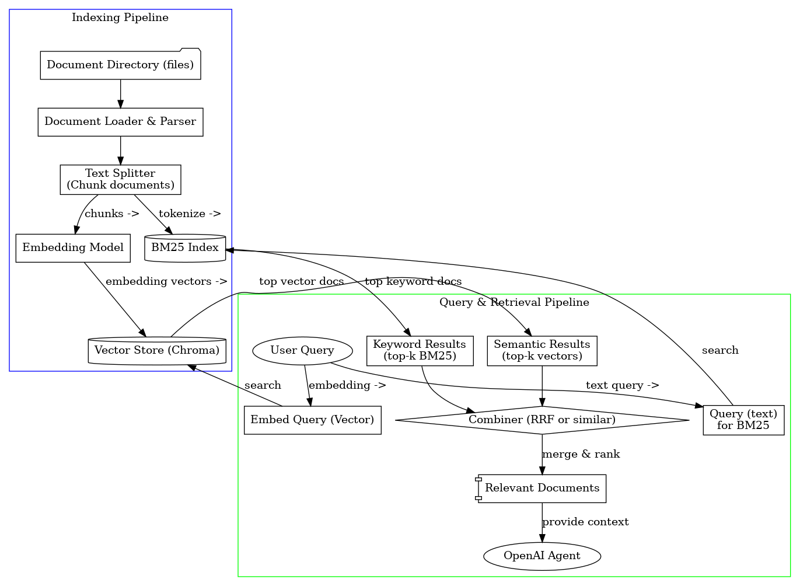

# FinderLedge: 文書コンテキスト管理ライブラリ設計
## 概要
FinderLedgeは、OpenAI Agents SDKと組み合わせてエージェントに動的な文書コンテキストを提供するためのドキュメント管理ライブラリです。ユーザーが文書を追加・削除するだけで、Embedding（ベクトル埋め込み）計算やBM25によるインデックス更新、キャッシュ構築などを自動で行い、数百〜数千規模のドキュメントから関連情報を効率的に検索・取得します。自然言語クエリやキーワード検索の両方に対応したハイブリッド検索機能により、意味的な関連性とキーワードのマッチ双方を活かした高精度な関連文書検索を実現します​。また、ローカルディレクトリ内のPDFやOfficeドキュメントも自動解析してインデックス化し、ベクトルデータベースやBM25インデックスをローカル永続化します。OpenAI Agents SDKとの緊密な連携を念頭に置きつつ、SDK非使用環境でもPythonライブラリとして汎用的に利用でき、ユーザーによる文書コンテキスト取得・管理の手間を最小化することを目指します。


## 主な機能
* 文書インポートと自動インデックス:
    ユーザーが追加したテキスト、PDF、Officeファイルなどの文書を自動パースし、EmbeddingベクトルとBM25用インデックスを更新・キャッシュ。​高速・低メモリ実装のBM25ライブラリを用いており、大量文書でも迅速にインデックス処理を行います。
* ハイブリッド検索: 
    自然言語による質問文でも、特定キーワードによる検索でも対応できるよう、ベクトル検索（Embedding類似度）とキーワード検索（BM25スコア）の両方で並行検索し、結果を統合します​。両手法の強みを活かし、略語・固有名も漏らさず、意味的関連も捉えた検索が可能です。検索結果のランキング統合には*Reciprocal Rank Fusion (RRF)*などの手法を用いて、両リストを単一の高精度なランキングに融合します​

* ディレクトリ丸ごとデータベース化:
    指定したフォルダ内の文書群を一括読み込み・インデックス化できます。例えばfinderledge(db="docs", dir="./docs")とすることで./docsフォルダ内の全ファイルを走査し、内容を抽出して「docs」というコレクション名のデータベースとして構築・保存します。以後はコレクション名docsを指定してロードするだけで、前回のインデックスを再利用できます。

* 多様な文書フォーマット対応:(現在は不要)
    テキストファイル（MarkdownやTXT等）はもちろん、PDFやWord/Excel/PowerPointなどOffice文書も投入可能です。PDFや画像化された文書についてはOpenAI/Gemini等の高度な解析機能をオプションで利用しテキスト抽出します。標準ではLangChainのDocument LoaderやPythonライブラリによるパースを行い、追加の特殊ソフト不要で利用できます。

* Embeddingによる類似度計算:
    埋め込みモデルはOpenAI API（例: text-embedding-ada-002）やローカルのOllama対応モデルなど、ユーザー環境に応じて選択可能です。LangChainの抽象化を利用し、OpenAIモデルを使用する場合はAPIキー設定だけで動作し、オフライン環境ではオープンソースの埋め込みモデル（例: InstructorXLや各種SentenceTransformer）も指定できます。エンベッディング生成は非同期にバッチ処理され、一度計算したベクトルはキャッシュされます。

* 高性能なBM25検索:
    キーワード検索にはbm25s-jライブラリを採用します。bm25s-jはPython製BM25実装「bm25s」を日本語対応に拡張したもので、内部でJanomeによる形態素解析を行い日本語文書でも適切にトークナイズします​。これにより日本語テキストに対しても高い検索精度を実現し、英語を含む多言語文書にも対応可能です。また、bm25s-jは依存関係が少なく軽量で、高速な検索性能を持ちます​

* インデックスとキャッシュの永続化:
    ベクトルストア（Chroma DB）やBM25のインデックスデータはローカルに永続化されます。初回読み込み時にEmbedding計算やインデックス構築を行った後、その結果を指定ディレクトリに保存するため、二回目以降の起動では即座にロード可能です。LangChainがラップするChromaはpersist_directoryを指定するとデータベースを自動保存・ロードする機能があり​、FinderLedgeではコレクション名やパスに基づき適切にこれを設定します。ユーザーは毎回重い前処理を行う必要がありません。

* シンプルな検索API:
    インスタンスに対して自然文の質問やキーワードを渡すだけで関連文書のリストを取得できます。検索結果は文書オブジェクト（タイトルやメタデータ、コンテンツテキストを含む）として返され、上位n件の関連度スコア順に並びます。必要に応じ、Embedding類似度検索のみ・BM25検索のみといったモード指定も可能です。

* OpenAI Agents SDKとの連携:
    Agents SDKのツール関数やコンテキストリトリーバとして直接利用できるインターフェースを提供します。検索をエージェントのツール（function calling）として登録し、エージェントは質問に応じてFinderLedgeから関連情報を取得できます。また、SDKのRunContextにFinderLedgeインスタンスを保持し、ツールから参照することで、会話中いつでも蓄積した文書知識にアクセスする設計が可能です。

* SDK非依存の利用:
    通常のPythonコードや他のフレームワーク（LangChainのQAチェーンなど）からも利用しやすいよう、シンプルなクラス設計としています。LangChainのRetrieverインタフェース（get_relevant_documentsメソッド）を実装したラッパークラスも用意し、必要ならばRetrievalQAチェーン等に組み込むこともできます。


## 内部構造とアーキテクチャ
FinderLedgeの内部アーキテクチャ概要。左側のインデックスパイプラインで文書ディレクトリからEmbeddingベクトルストア（Chroma）とBM25インデックスを構築・更新し、右側のクエリパイプラインでユーザ質問に対しベクトル検索とBM25検索を並行実行、結果を融合して関連文書を取得する。 



FinderLedgeは大きく分けて「インデックス作成パイプライン」と「検索（クエリ）パイプライン」の2つの処理系で構成されています。インデックス作成パイプラインでは、指定されたディレクトリから文書ファイル群を読み込み、各文書のテキストを抽出・分割（チャンク化）します。抽出にはLangChainの各種DocumentLoader（例えばPDF用、Word用など）やテキスト抽出ロジックを利用し、必要に応じてOpenAI/GeminiのAPIを呼び出してOCRやレイアウト認識を行います。チャンク化は長文を適切な長さ（例: 500文字程度）に区切る処理で、LangChainのRecursiveCharacterTextSplitterなどにより実装します。チャンクごとにEmbeddingを計算し、そのベクトルをChromaのベクトルストアに格納します。一方で同じテキストからBM25インデックスも構築します。bm25s-jでは内部で各文書コーパスをトークンリスト化しBM25モデルを生成します（インメモリで保持し、必要に応じ更新）​。これらの処理はFinderLedge初期化時（または新規文書追加時）に自動で行われ、ユーザーが明示的にインデックス構築を意識する必要はありません。

検索パイプラインでは、ユーザーからのクエリ文字列に対し、まずEmbeddingモデルを用いてクエリ自体をベクトル化します。このクエリベクトルを元にChromaベクトルストア内で最近傍ベクトル検索を行い、セマンティックに関連度の高い上位k件の文書を取得します。同時に、クエリ文字列をBM25用にトークン分割してBM25インデックスにも照会を行い、キーワード一致度の高い上位k件の文書を取得します​。こうして得られた「ベクトル検索結果リスト」と「キーワード検索結果リスト」を結果融合コンポーネントで統合し、総合的な関連度で再ランキングした最終的な関連文書リストを生成します​。結果融合にはデフォルトで**RRF (Reciprocal Rank Fusion)**アルゴリズムを採用します​。。各リスト内の順位に基づき文書にスコアを付与し、両方のスコアを合算して再スコアリングすることで、両方の手法で上位に来る文書を優先する統一ランキングが得られます（RRFでは順位rに対し1/(r+k)のスコアを与え、全リストの和で評価します​）。最終的な関連文書群（Relevant Documents）は、そのままエージェントへのコンテキストとして入力したり、ユーザーに提示したりできる形で返却されます。これら一連の処理は非同期化やキャッシュを活用して高速化されており、多少文書数が増大しても対話的な応答速度を保ちます。


## クラス設計
FinderLedgeライブラリは、シンプルかつ拡張性のあるクラス構造を備えています。主なクラスおよびコンポーネントは以下の通りです。

* FinderLedge クラス:
    ライブラリの中核となる高水準インターフェースを提供するクラスです。文書コレクション（データベース）のロード・追加・削除、検索クエリの処理など主要機能を持ちます。内部的にはベクトルストアやBM25エンジンへの参照を保持し、それらを統括します。
    プロパティ: db_name（コレクション名）、persist_dir（永続化先ディレクトリパス）、embedding_model（使用するEmbeddingモデルまたはエンコーダ）、vector_store（Chromaのインスタンス）、bm25_index（bm25s-jのインデックスオブジェクト）、documents（文書メタデータリストなど）を管理します。
    初期化: __init__(db: str, dir: Optional[str] = None, **options)
    コレクション名dbと文書ディレクトリdirを指定してインスタンス化します。指定されたdir内の全文書を読み込み、既存のインデックスデータがローカルにあればそれをロードします。無ければ新規にEmbedding計算・インデックス構築を行い、構築後にローカル保存します（保存パスはpersist_dirに基づき自動決定）。optionsでは後述する各種オプション（埋め込みモデル種類、チャンクサイズ、上位k件数など）を設定可能です。
* Document（文書） クラス:
    各文書を表現するデータクラスです。文書IDやタイトル、テキスト本文、メタデータ（ファイルパス、更新日時など）を保持します。検索結果として返す際にもこのクラスインスタンスのリストで提供します。LangChainのDocumentクラス互換のインターフェースを持ち、.page_contentや.metadataプロパティで内容にアクセスできます。
* EmbeddingModel クラス/インタフェース:
    抽象的なEmbedding計算機能を表します。具体的にはOpenAIのEmbeddings APIラッパーやOllamaのローカルモデル呼び出しを実装したクラスのインスタンスが渡されます。FinderLedgeはこれを用いてembed(text: str) -> List[float]の形でベクトル化します。デフォルト実装としてLangChainのOpenAIEmbeddingsやHuggingFaceエンコーダを内包できます。
* VectorStore（Chroma）:
    LangChain経由で利用するベクトルデータベースです。vector_storeプロパティにはChromaのインスタンスを保持し、add_documents(), similarity_search() 等のメソッドで操作します。Chromaはpersist_directoryを指定することでローカルにデータを保存・再利用でき​、FinderLedgeではpersist_dirとして例えば"./indexes/{db_name}"のようなパスを設定します。これにより、db_name毎にベクトルストアがディスク上に保持されます。
* BM25Index:
    bm25s_j.BM25（bm25s-jライブラリ）のインスタンスを保持します。bm25_indexプロパティとして管理され、検索時にはbm25_index.search(query_tokens, top_n)のようなメソッド（※実際のAPIはライブラリに準拠）で上位文書スコアを取得します。bm25s-jにはコーパスの追加・削除用の明示的メソッドはありませんが、FinderLedgeでは内部的に文書リストを更新し再インデックスを走らせることで対応します。少数の追加・削除であれば負荷は小さいため、数千文書規模なら十分実用的です。
* Retrieverインタフェース:
    SDKやLangChainとの統合向けに、FinderLedgeインスタンス自体、もしくは専用のRetrieverクラスがget_relevant_documents(query: str) -> List[Document]メソッドを実装します。これによりLangChainのChainやOpenAI AgentがFinderLedgeを通じて文書取得できるようになります。

内部構造としては、FinderLedgeクラスが上記各コンポーネントを持ち、ユーザから見えるAPI呼び出し（メソッド）でそれらを適切に呼び出すようになっています。例えばsearch()メソッドでは、embedding_modelを使ってqueryをベクトル化→vector_storeで類似検索→bm25_indexでBM25検索→結果統合、という一連の処理を内包します。


## 主要APIと使用例

FinderLedgeはPythonライブラリとして簡潔なAPIを提供し、少ないコードで文書管理・検索を実現できます。以下に主なメソッドとその利用例を示します。

### インスタンス生成とデータベースロード:

```python
from finderledge import FinderLedge

# "docs"という名前でコレクションを作成 or ロードし、./docsフォルダ内の文書を取り込む
fl = FinderLedge(db="docs", dir="./docs", embedding_model="openai", persist_dir="./indexes/docs")
```

上記コードでは、カレントディレクトリの./docs以下にある全文書を読み込み、コレクション名「docs」として初期化しています。persist_dirを指定しているため、インデックスデータは./indexes/docs/以下に保存されます（指定しない場合はデフォルトで./finderledge_storage/docs/などに保存）。embedding_modelに"openai"を指定すると、OpenAIの埋め込みAPI（デフォルトモデル）を使用します。初回実行時、フォルダ内のファイルを順次パースしてEmbeddingとBM25の両インデックスを構築し、以降はflオブジェクト経由で検索が可能になります。

### 文書の追加と削除:

FinderLedgeではadd_document()およびremove_document()メソッドで動的に文書集合を更新できます。例えば:

```python
fl.add_document("./docs/new_report.pdf")
```

とすると、新たなPDFファイルをパースしてコーパスに追加し、Embeddingベクトル計算とBM25インデックスへの反映が自動で行われます。同様に:

```python
fl.remove_document(doc_id="file_123")
```
のように文書IDやパスを指定して削除すれば、その文書に対応するベクトルおよびBM25データがコレクションから除去されます（このときベクトルストア・BM25インデックスの差分更新が走ります）。IDは内部管理のユニークIDか、メタデータとしてのファイルパス等で指定できます。

### 文書検索（クエリ問い合わせ）:
文書検索はfind_related()などのメソッド名で提供します（仮称。searchやquery等もエイリアス可）。使い方は:

```python
query = "最新の製品ロードマップについて教えて"
results = fl.find_related(query, top_k=5)
for doc in results:
    print(f"- {doc.metadata['title']} (score: {doc.score:.2f})")
    print(doc.content[:200] + "...\n")
```

ここでは、日本語の質問文に対し上位5件の関連文書を取得しています。resultsはDocumentオブジェクトのリストで、各Documentに検索スコア（score）やメタデータが含まれています。例えばタイトルと冒頭200文字を表示しています。このメソッド内部で前述のハイブリッド検索が行われ、意味的に関連する文書もキーワード一致する文書もバランスよく含まれます。 検索モードの指定: 第3引数などでmode="hybrid"（デフォルト）/"semantic"/"keyword"を指定でき、必要に応じてハイブリッド検索以外の単独モードも選択可能です。例えばfl.find_related("...", mode="keyword")とすればBM25による純粋なキーワード検索のみを行います。
関連コンテキスト取得: エージェントへのコンテキストとして直接使える文字列を取得したい場合、get_context(query)のようなヘルパーも用意します。これは上位N件の文書本文をまとめて一つの文字列や特定フォーマットに連結したものを返すメソッドです。
例えば:

```python
context_text = fl.get_context(query="製品ロードマップ")
print(context_text)
```

とすると、「関連文書1のタイトルと内容...\n===\n関連文書2のタイトルと内容...」のように区切り付きで関連情報をまとめたテキストを得られます。これをそのままLLMへのプロンプトに追加することでRAG（Retrieval Augmented Generation）的に回答の精度を上げることができます。

以上のAPIはFinderLedgeクラス内で直感的に利用でき、ユーザーは文書の中身取得や複雑な検索ロジックを意識せずに必要な情報を引き出せます。

## オプション設定とカスタマイズ
FinderLedgeでは利用シナリオに応じて様々な設定オプションを調整できます。主要なオプション項目は以下のとおりです。

### 埋め込みモデル選択 (embedding_model):
OpenAI APIを使う場合はモデル名（例: "text-embedding-ada-002"）やOpenAIEmbeddingsオブジェクトを指定。ローカルモデルを使う場合は例えば"ollama://<モデル名>"のようなプロトコルで指定したり、HuggingFaceのモデル名を渡すことも検討中です。デフォルトは環境にAPIキーが設定されていればOpenAI、無ければコンサルートメッセージを出します。

### チャンクサイズ・重複 (chunk_size, chunk_overlap):
文書を分割する際の1チャンクあたり文字数と重複幅を指定します。長すぎるチャンクはEmbedding計算時に切り捨てられる可能性があるため、モデルの最大トークン長以下になるよう設定します（例: 1000文字）。重複を持たせることでチャンク境界にまたがる情報の欠落を防ぎます。デフォルトはchunk_size=500,chunk_overlap=50程度。
検索上位件数 (top_k): find_relatedで返す件数、および内部的にベクトル検索・BM25検索それぞれで取得する件数を設定します。デフォルト5〜10件。融合時に例えば各リスト上位10件ずつ取得してRRFで上位5件を最終返却、などのロジックになります。

### スコア融合方式 (fusion_method):
ハイブリッド検索での結果統合手法を選択できます。デフォルトは"RRF"ですが、他にスコアを正規化して加重平均する方法（BM25スコアとコサイン類似度を0〜1に正規化して重み付け合算）なども選べます​。fusion_method="RRF"の場合、内部でRRFアルゴリズムを実行し、fusion_method="average"の場合は単純平均で統合、といった実装になります。用途に応じて切り替え可能ですが、RRFが一般には堅牢です​。

### ストップワードカスタマイズ (stopwords):

BM25検索時に除外する単語（ストップワード）のリストを指定できます。bm25s-jはデフォルトで日本語ストップワードを組み込んでいますが​、必要なら追加や英語等の別言語のストップワードもここで設定可能です。


### ログ設定 (verbose):
Trueにすると文書読み込みやインデックス更新、検索の各ステップでログメッセージを出力します。デフォルトFalse。デバッグ用途です。

### キャッシュ制御 (cache_enabled):

デフォルトTrueで、一度Embedding計算したテキストは再計算しないよう内部キャッシュします。Falseにすると毎回embeddingを計算します（モデル切り替え時などに使用）。

オプションはFinderLedge初期化時にパラメータとして渡すか、あるいはfl.config.update({...})のようなインターフェースで後から変更できるように設計します（一部は再インデックスが必要になるため、その場合自動で再構築が走るか、手動でfl.reindex()を呼ぶ形とします）。

## データ保存先の管理仕様
FinderLedgeはローカル環境にインデックスデータを保存し、再利用します。ユーザーはdb（コレクション名）とpersist_dirを指定できます。設計上のデフォルト挙動は以下の通りです。

### デフォルト保存ディレクトリ:
persist_dirを省略した場合、現在の作業ディレクトリに隠しフォルダ.finderledge/を作成し、その下にコレクション名ごとのサブフォルダ（例: .finderledge/docs/）を作ります。ここにChromaのデータベースファイル（SQLiteファイル等）やbm25のインデックスを保存します。例えば上記例では.finderledge/docs/chroma.sqlite等が生成され、bm25用にはdocs_corpus.jsonやdocs_bm25.npz等のファイルにコーパスと言語統計を保存する実装にします。

### 永続化のタイミング:
FinderLedgeは大きな変更操作後（初期構築、文書追加・削除後）に自動でpersist()処理を呼び出します。これによりベクトルストアはディスクにコミットされ、bm25インデックスも保存されます。アプリケーション終了時に明示的にfl.close()やfl.persist()を呼ぶことで安全に同期させることもできますが、基本的には自動で同期される設計です。
複数コレクション管理: 異なるdb_nameを指定すれば別個の文書コレクションとして管理されます。例えばdb="manuals"とすれば.finderledge/manuals/以下に別のインデックスが保存され、FinderLedge(db="manuals")でロードできます。内部的にはChromaにおけるCollection単位と1対1対応させるか、またはコレクション名をディレクトリに反映して分離することで実現します。

### ストレージ容量:
保存されるデータはEmbeddingベクトル（次元数≈1536×文書チャンク数、8バイト浮動小数×要素数）とBM25用圧縮インデックス（単語辞書と出現リスト）です。数千文書規模であれば数百MB程度のディスク容量を想定します。必要に応じ古いコレクションフォルダを削除すれば関連データは消去されます。

## OpenAI Agents SDKとの連携
OpenAI Agents SDKを用いることで、FinderLedgeをエージェントの知識源として組み込むことができます。具体的には、FinderLedgeをエージェントのツール関数あるいはコンテキストとして統合する二通りの方法が考えられます。


### Tool（ツール）として統合:
Agents SDKでは@function_toolデコレータを用いて関数をエージェントのツール（関数呼び出し可能アクション）として登録できます。FinderLedgeを使って文書検索を行う関数を用意し、エージェントに使わせることができます。例:

```python
from agents import Agent, RunContextWrapper, function_tool

fl = FinderLedge(db="docs")  # 事前に初期化・ロード済みとする

@function_tool
async def find_docs(wrapper: RunContextWrapper[None], query: str) -> str:
    # ツール関数: クエリに対する関連文書のテキストを返す
    results = fl.find_related(query, top_k=3)
    # 文書タイトルと内容をまとめて文字列化
    return "\n\n".join([f"{doc.metadata['title']}:\n{doc.content}" for doc in results])

agent = Agent(name="Assistant", tools=[find_docs], ... )
result = await agent.run(input="製品ロードマップを教えて")
```

上記では、find_docsというツールを定義し、その中でfl.find_relatedを呼び出して関連文書の内容を返しています。エージェントはユーザから「製品ロードマップを教えて」と質問された際、この関数を呼び出すプランを立て、FinderLedgeから得た文書内容をもとに回答を組み立てます。Toolsとして組み込むことで、エージェントが必要に応じ文書検索を行う**Retrieval-Augmented Generation (RAG)**スタイルの振る舞いを実現できます。

### コンテキスト（RunContext）として統合:
Agents SDKではRunner.run(..., context=ctx_obj)の形でエージェント実行に任意のコンテキストオブジェクトを提供できます​。この機構を利用し、FinderLedgeインスタンスをコンテキストに含めておけば、ツール関数内でグローバル変数に頼らずコンテキスト経由でアクセスできます。例えば:

```python
from dataclasses import dataclass
@dataclass
class DocContext:
    docs: FinderLedge

ctx = DocContext(docs=fl)

@function_tool
async def find_docs(wrapper: RunContextWrapper[DocContext], query: str) -> str:
    docs = wrapper.context.docs  # コンテキストからFinderLedge取得
    results = docs.find_related(query, top_k=3)
    ...
    return combined_text

agent = Agent[DocContext](name="Assistant", tools=[find_docs], ...)
result = await Runner.run(starting_agent=agent, input="ロードマップは？", context=ctx)
```

これにより、エージェント実行中のあらゆるツールからwrapper.context.docsとしてFinderLedgeインスタンスにアクセス可能になります​。コンテキスト型にFinderLedgeを含めたジェネリクス指定(Agent[DocContext])をすることで型チェックも利き、安全に共有できます。この方法では、エージェントが自律的に判断してfind_docsを呼び出し、文書内容を取得・使用します。

いずれの統合方法でも、FinderLedge側は特別な対応コードを書く必要はなく、提供する通常のメソッドをそのまま呼び出す形でOKです。Agents SDKとの親和性を高めるため、FinderLedgeの検索結果は文字列や辞書などシリアライズしやすい形式にも容易に変換できるようにしてあります（例えばDocumentオブジェクトからJSONへの変換メソッドを用意するなど）。 また、Agents SDK以外にも、OpenAIの関数呼び出しAPIを直接使う場合にも類似の統合が可能です。すなわち、functions=[ ... {"name": "find_docs", "parameters": {...}} ...]を用意し、その実装としてFinderLedge検索を行う関数を紐付ける形です。このようにFinderLedgeはエージェントないしLLMから使いやすいインタフェースを想定して設計されています。

## SDK非使用時の利用方法
FinderLedgeは、OpenAI Agents SDKを使わない場合でも強力なドキュメント検索基盤として活用できます。例えば以下のようなケースがあります。

### LangChainによるQAシステム:
LangChainのRetrievalQAチェーンに統合する場合、FinderLedgeをLangChainのRetriever互換オブジェクトとして扱います。FinderLedgeにはas_retriever()メソッド（もしくはFinderLedgeRetrieverクラス）があり、これを呼ぶとBaseRetrieverを継承したオブジェクトを取得できます。

```python
retriever = fl.as_retriever()  # FinderLedgeからRetriever取得
qa_chain = RetrievalQA.from_chain_type(llm, retriever=retriever, chain_type="stuff")
answer = qa_chain.run("製品ロードマップの概要は？")
```

こうすると、LangChain内部でretriever.get_relevant_documents("製品ロードマップの概要は？")が呼ばれ、FinderLedgeが上位文書を返します。それを元にstuff（詰め込み）プロンプトを生成しLLMが回答を作成します。LangChainのMemoryと組み合わせれば対話的なQAボットにも応用できます。

### スタンドアロンスクリプトでの検索:

単に大量の文書から情報検索したい場合にも、FinderLedgeは便利です。例えば研究論文のコーパスに対し関連論文を探すツールや、社内ドキュメントからFAQ回答を自動抽出するスクリプトなどにそのまま使えます。シンプルなAPIで検索ができるため、Jupyterノートブックでの対話利用や、バックエンドサービスへの組み込みも容易です。

### 他のエージェントフレームワークとの統合:

HaystackやLlamaIndexなど他のRAGフレームワークでも、FinderLedgeの検索結果を渡したり、Documentストアとして差し替えることができます。例えばLlamaIndex（旧称GPT Index）では、FinderLedgeから得た文書群をそのままIndexStructに詰め込み、QueryEngineに与えることで同等の検索拡張が可能です。
